# 🛒 ShoppyGlobe — E-Commerce Backend API

> A production-ready RESTful backend for the ShoppyGlobe e-commerce application built with **Node.js**, **Express.js**, and **MongoDB**.

**Student Submission | Backend Development Assignment**

---

---

## 🛠️ Tech Stack

| Technology | Version | Purpose |
|---|---|---|
| Node.js | v18+ | JavaScript Runtime |
| Express.js | 5.x | Web Framework |
| MongoDB | Latest | NoSQL Database |
| Mongoose | 9.x | MongoDB ODM |
| bcryptjs | 3.x | Password Hashing |
| jsonwebtoken | 9.x | JWT Authentication |
| express-validator | 7.x | Input Validation & Sanitization |
| dotenv | 17.x | Environment Variables |
| nodemon | 3.x | Dev Auto-restart |

---

## 📁 Project Structure

```
shoppyglobe/
├── config/
│   └── db.js                  # MongoDB connection setup
├── controllers/
│   ├── authController.js      # Register & Login logic
│   ├── cartController.js      # Cart CRUD operations
│   └── productController.js   # Product fetch operations
├── middleware/
│   └── auth.js                # JWT protect middleware
├── models/
│   ├── Cart.js                # Cart mongoose schema
│   ├── Product.js             # Product mongoose schema
│   └── User.js                # User mongoose schema
├── routes/
│   ├── authRoutes.js          # /register, /login
│   ├── cartRoutes.js          # /cart (all protected)
│   └── productRoutes.js       # /products (public)
├── .env.example               # Environment variable template
├── .gitignore
├── package.json
├── README.md
├── seed.js                    # Sample data seeder
└── server.js                  # Main entry point
```

---

## ⚙️ Setup & Installation

### Prerequisites
- [Node.js v18+](https://nodejs.org/)
- [MongoDB Community](https://www.mongodb.com/try/download/community) **or** [MongoDB Atlas](https://cloud.mongodb.com/) (free)

### Step 1 — Clone the repository
```bash
git clone https://github.com/Sufalthakre18/shoppyglobe-backend-api
cd shoppyglobe-backend-api
```

### Step 2 — Install dependencies
```bash
npm install
```

### Step 3 — Configure environment variables
```bash
cp .env.example .env
# Edit .env with your MongoDB URI and JWT secret
```

### Step 4 — Seed sample products into MongoDB
```bash
node seed.js
```

### Step 5 — Start the server
```bash
npm run dev      # Development (auto-restart)
npm start        # Production
```

✅ Server: **http://localhost:5000**

---

## 🔐 Environment Variables

```env
PORT=5000
MONGO_URI=mongodb://localhost:27017/shoppyglobe
JWT_SECRET=shoppyglobe_super_secret_key_2024
JWT_EXPIRE=7d
```

---

## 🗄️ Database Schema & MongoDB Screenshots

### Collections Overview

#### `users` collection
| Field | Type | Rules |
|---|---|---|
| `_id` | ObjectId | Auto-generated |
| `name` | String | Required, max 50 chars |
| `email` | String | Required, unique, validated |
| `password` | String | Hashed (bcrypt), hidden from queries |
| `createdAt` | Date | Auto |
| `updatedAt` | Date | Auto |

#### `products` collection
| Field | Type | Rules |
|---|---|---|
| `_id` | ObjectId | Auto-generated |
| `name` | String | Required, max 100 chars |
| `price` | Number | Required, min 0 |
| `description` | String | Required, max 500 chars |
| `stockQuantity` | Number | Required, min 0 |
| `category` | String | Default: "General" |
| `imageUrl` | String | Optional |
| `createdAt` | Date | Auto |
| `updatedAt` | Date | Auto |

#### `carts` collection
| Field | Type | Rules |
|---|---|---|
| `_id` | ObjectId | Auto-generated |
| `user` | ObjectId | Ref: User, unique (1 cart per user) |
| `items[].product` | ObjectId | Ref: Product |
| `items[].quantity` | Number | Min 1 |
| `createdAt` | Date | Auto |
| `updatedAt` | Date | Auto |

---

### 📸 MongoDB Screenshots

#### Users Collection

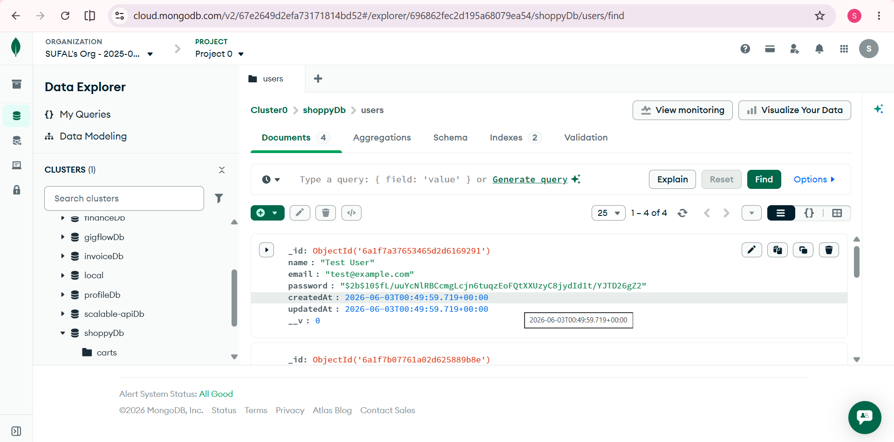

#### Products Collection
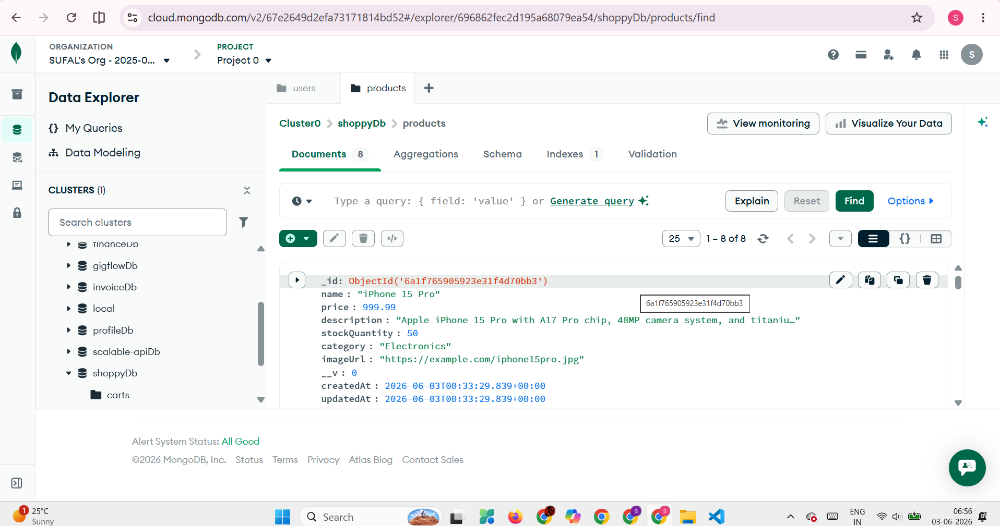

#### Carts Collection

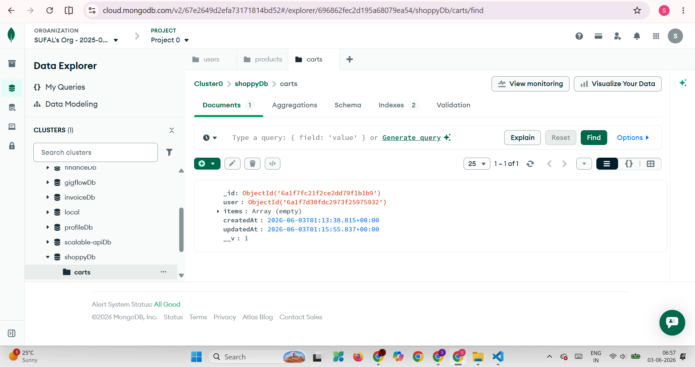


---

## 📡 API Reference

### Base URL
```
http://localhost:5000
```

---

### 🔑 Auth Routes — Public

#### `POST /register`
Register a new user.

**Request Body:**
```json
{
  "name": "John Doe",
  "email": "john@example.com",
  "password": "password123"
}
```

**Success `201`:**
```json
{
  "success": true,
  "message": "User registered successfully",
  "token": "eyJhbGciOiJIUzI1NiIsInR5cCI6IkpXVCJ9...",
  "user": { "id": "...", "name": "John Doe", "email": "john@example.com" }
}
```

---

#### `POST /login`
Authenticate and receive JWT token.

**Request Body:**
```json
{
  "email": "john@example.com",
  "password": "password123"
}
```

**Success `200`:**
```json
{
  "success": true,
  "message": "Login successful",
  "token": "eyJhbGciOiJIUzI1NiIsInR5cCI6IkpXVCJ9...",
  "user": { "id": "...", "name": "John Doe", "email": "john@example.com" }
}
```

---

### 📦 Product Routes — Public

#### `GET /products`
Fetch all products.

**Success `200`:**
```json
{
  "success": true,
  "count": 8,
  "data": [ { "_id": "...", "name": "iPhone 15 Pro", "price": 999.99, ... } ]
}
```

---

#### `GET /products/:id`
Fetch a single product by ID.

**Success `200`:**
```json
{
  "success": true,
  "data": { "_id": "...", "name": "iPhone 15 Pro", "price": 999.99, ... }
}
```

**Error `404`:**
```json
{ "success": false, "message": "Product not found" }
```

---

### 🛒 Cart Routes — Protected (JWT Required)

> Add this header to every cart request:
> `Authorization: Bearer <your_token>`

---

#### `GET /cart`
Get the logged-in user's cart with product details and total price.

#### `POST /cart`
Add a product to cart.
```json
{ "productId": "664f...", "quantity": 2 }
```

#### `PUT /cart/:productId`
Update quantity of a cart item.
```json
{ "quantity": 5 }
```

#### `DELETE /cart/:productId`
Remove a product from cart. No body required.

---

## 📸 API Testing Screenshots (Thunder Client)

> All routes tested using **Thunder Client** VS Code extension.

---

### 1. POST /register — Register User

<!-- SCREENSHOT: Thunder Client POST /register with body and 201 response -->
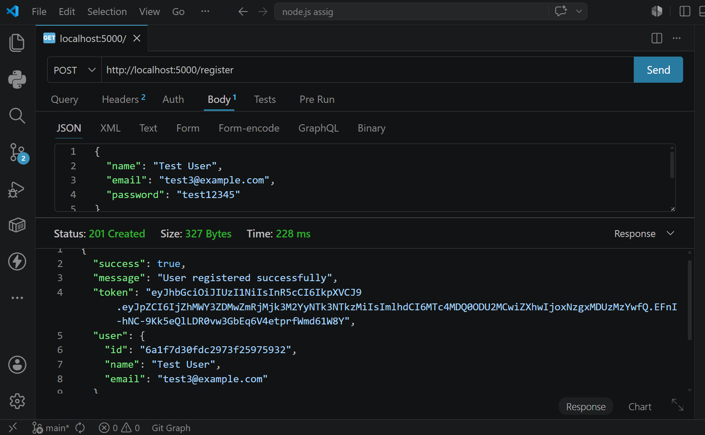

---

### 2. POST /login — Login & Get Token

<!-- SCREENSHOT: Thunder Client POST /login showing token in response -->
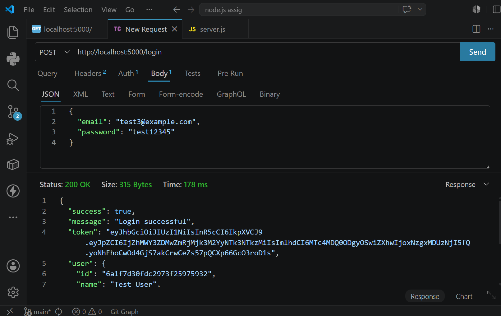

---

### 3. GET /products — All Products

<!-- SCREENSHOT: Thunder Client GET /products showing product list -->
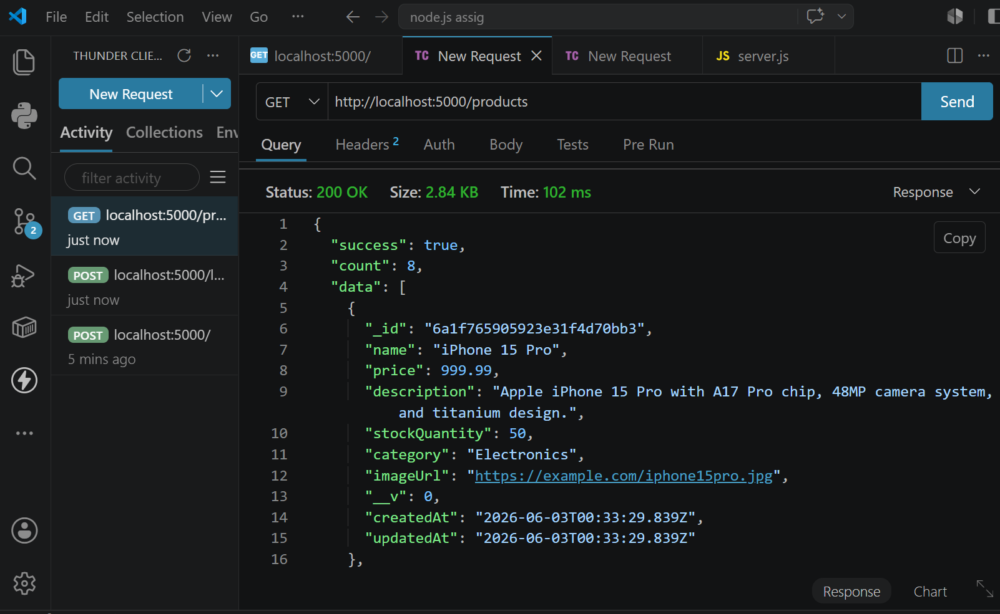

---

### 4. GET /products/:id — Single Product

<!-- SCREENSHOT: Thunder Client GET /products/:id showing single product -->
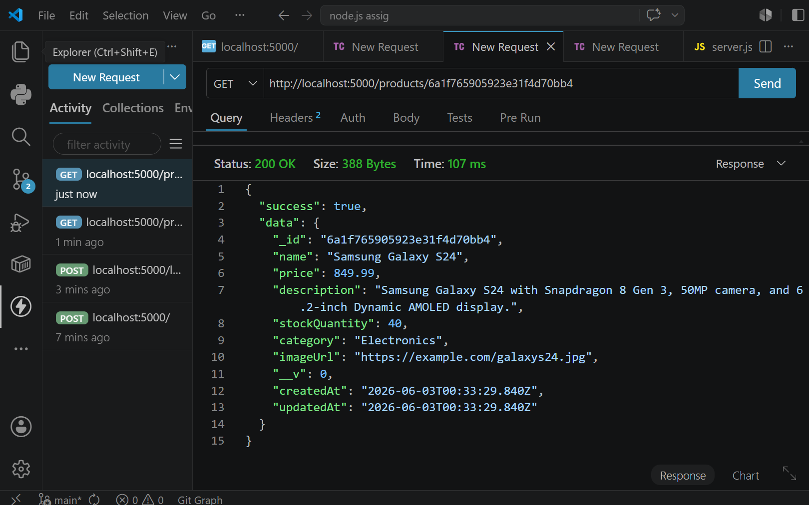

---

### 5. GET /cart — Get Cart (Protected)

<!-- SCREENSHOT: Thunder Client GET /cart with Authorization header -->
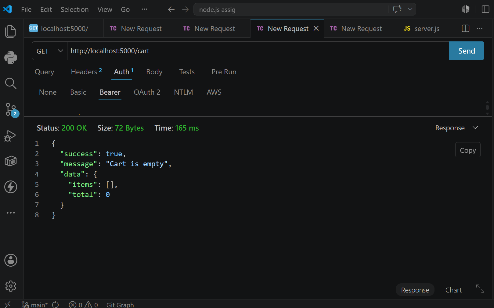

---

### 6. POST /cart — Add to Cart (Protected)

<!-- SCREENSHOT: Thunder Client POST /cart with productId + quantity body and auth header -->
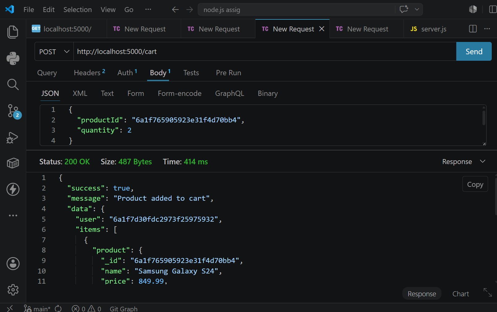

---

### 7. PUT /cart/:productId — Update Quantity (Protected)

<!-- SCREENSHOT: Thunder Client PUT /cart/:productId with quantity body and auth header -->
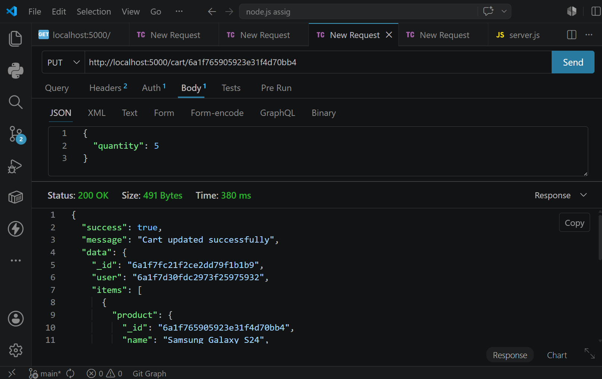

---

### 8. DELETE /cart/:productId — Remove from Cart (Protected)

<!-- SCREENSHOT: Thunder Client DELETE /cart/:productId with auth header -->
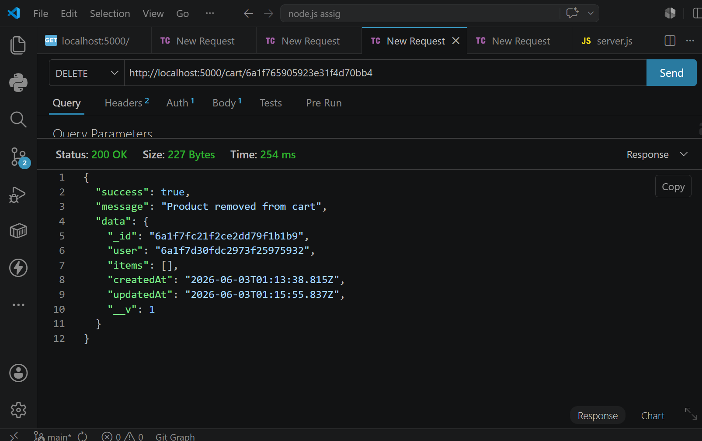

---

### 9. Error — No Token (401)

<!-- SCREENSHOT: Thunder Client GET /cart without Authorization header showing 401 -->
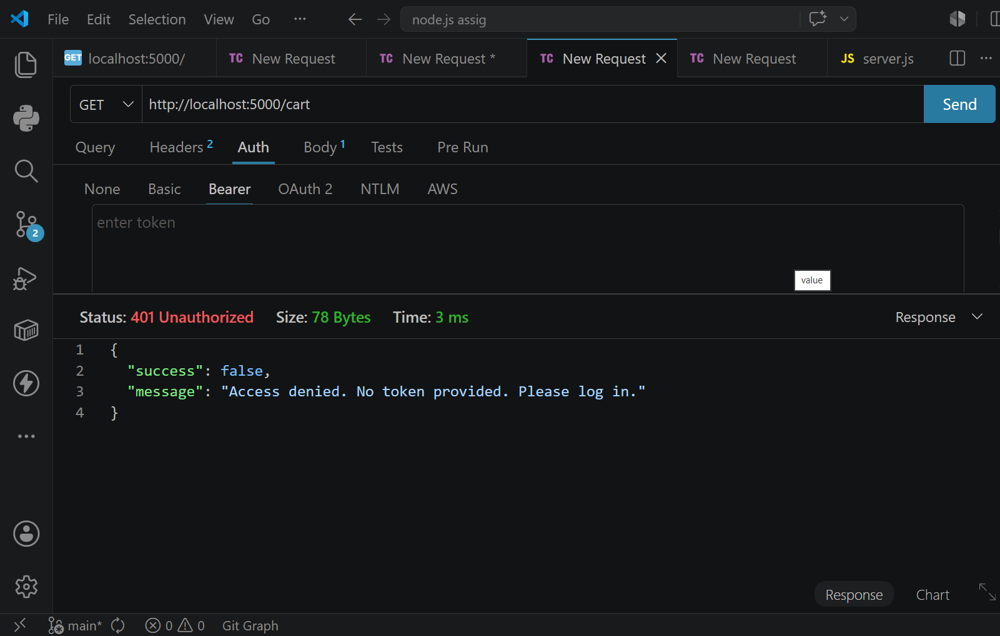

---

### 10. Error — Invalid Product ID (404)

<!-- SCREENSHOT: Thunder Client GET /products/000000000000000000000000 showing 404 -->
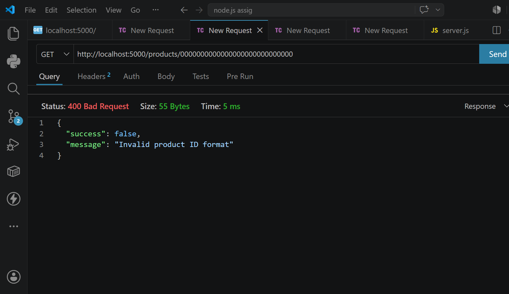

---

## 🔄 Authentication Flow

```
Client                          Server
  │                               │
  ├── POST /register ────────────>│ Hash password, save user
  │<── 201 + JWT token ───────────┤
  │                               │
  ├── POST /login ───────────────>│ Verify password, sign JWT
  │<── 200 + JWT token ───────────┤
  │                               │
  ├── GET /cart                   │
  │   Authorization: Bearer <JWT>─>│ Verify JWT, attach req.user
  │<── 200 + cart data ───────────┤
```

---

## ❌ Error Handling

All routes return consistent error responses:

```json
{
  "success": false,
  "message": "Human-readable error message"
}
```

| Status | When |
|---|---|
| `400` | Validation failed / bad input |
| `401` | No token / invalid token / wrong credentials |
| `404` | Product or cart item not found |
| `500` | Unexpected server error |

**Validations implemented:**
- Name, email, password format checked on register
- Email + password required on login
- Product ID existence verified before adding to cart
- Stock availability checked before adding/updating cart
- Invalid MongoDB ObjectId format caught and returned as `400`

---

## 🔒 Security Features

| Feature | Implementation |
|---|---|
| Password hashing | bcryptjs, salt rounds: 10 |
| JWT signing | HS256 algorithm, expires in 7 days |
| Password hidden | `select: false` on schema field |
| Protected routes | `protect` middleware on all cart routes |
| Input validation | express-validator on all POST/PUT routes |
| Generic auth errors | Never reveals if email exists |

---

## 🌱 Sample Data (Seeded Products)

Run `node seed.js` to insert these 8 products:

| Product | Price | Category |
|---|---|---|
| iPhone 15 Pro | $999.99 | Electronics |
| Samsung Galaxy S24 | $849.99 | Electronics |
| Sony WH-1000XM5 Headphones | $349.99 | Electronics |
| Nike Air Max 270 | $150.00 | Footwear |
| MacBook Air M3 | $1,299.99 | Computers |
| Levi's 501 Original Jeans | $69.99 | Clothing |
| Instant Pot Duo 7-in-1 | $89.99 | Kitchen |
| The Alchemist — Paulo Coelho | $14.99 | Books |

---

---

## 👤 Author

**SUFAL THAKRE**